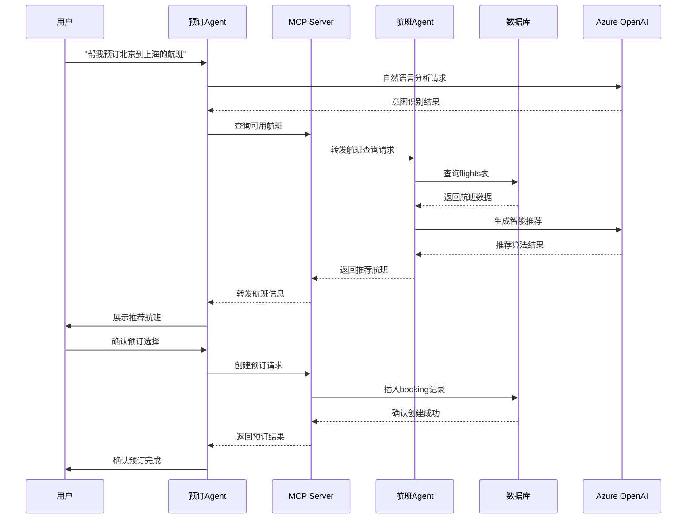

# 🎫 智能机票预订系统 (Smart Flight Booking System)

[](https://python.org)
[](https://fastapi.tiangolo.com)
[](https://sqlite.org)
[](https://azure.microsoft.com/en-us/products/ai-services/openai-service)

这是一个基于**多智能体协作**架构和**MCP（Model Context Protocol）**的智能机票预订系统。系统通过两个协作的AI Agent实现完整的机票查询、预订和管理功能，展示了现代AI Agent间通信和协作的最佳实践。

## 📖 目录

- [🏗️ 系统架构](#️-系统架构)
- [✨ 核心功能](#-核心功能)
- [🛠️ 技术栈](#️-技术栈)
- [🚀 快速开始](#-快速开始)
- [⚙️ 配置说明](#️-配置说明)
- [🎮 使用指南](#-使用指南)
- [📚 API文档](#-api文档)
- [🔧 开发指南](#-开发指南)
- [🌟 项目亮点](#-项目亮点)
- [🔧 故障排除](#-故障排除)

## 🏗️ 系统架构

### 整体架构概述

本系统采用**分布式多智能体架构**，基于**MCP（Model Context Protocol）**协议实现Agent间的标准化通信。系统设计遵循**微服务架构**原则，通过**松耦合**的组件实现高可用性和可扩展性。

```
┌─────────────────────────────────────────────────────────────────────────────────────┐
│                           智能机票预订系统 - 分层架构图                                │
└─────────────────────────────────────────────────────────────────────────────────────┘

┌─────────────────────────────────────────────────────────────────────────────────────┐
│                              🎯 用户交互层 (User Interface)                           │
├─────────────────────────────────────────────────────────────────────────────────────┤
│  📱 CLI交互界面     │  🌐 REST API客户端   │  🤖 智能对话接口                        │
│  • 命令行交互       │  • HTTP请求/响应     │  • 自然语言处理                           │
│  • 实时反馈        │  • JSON数据格式      │  • 上下文理解                            │
└─────────────────────────────────────────────────────────────────────────────────────┘
                                            │
                                            ▼
┌─────────────────────────────────────────────────────────────────────────────────────┐
│                            🤖 多智能体协作层 (Multi-Agent Layer)                      │
├─────────────────────────────────────────────────────────────────────────────────────┤
│                                                                                     │
│  ┌─────────────────────┐    MCP协议通信    ┌─────────────────────┐                  │
│  │  🎫 预订管理Agent   │◄─────────────────►│  ✈️ 航班查询Agent   │                  │
│  │  (BookingAgent)     │                   │  (AirlineAgent)     │                  │
│  │                     │                   │                     │                  │
│  │ 🔹 预订CRUD操作     │                   │ 🔹 航班数据管理      │                  │
│  │ 🔹 智能对话处理     │                   │ 🔹 路线搜索优化      │                  │
│  │ 🔹 业务逻辑验证     │                   │ 🔹 价格比较分析      │                  │
│  │ 🔹 状态管理        │                   │ 🔹 座位可用性查询    │                  │
│  │ 🔹 AI决策支持      │                   │ 🔹 智能推荐算法      │                  │
│  └─────────┬───────────┘                   └─────────┬───────────┘                  │
│            │                                         │                              │
│            └─────────────────┐     ┌─────────────────┘                              │
└─────────────────────────────────────────────────────────────────────────────────────┘
                              │     │
                              ▼     ▼
┌─────────────────────────────────────────────────────────────────────────────────────┐
│                          🌐 MCP协议通信层 (MCP Protocol Layer)                       │
├─────────────────────────────────────────────────────────────────────────────────────┤
│                       🔄 标准化Agent间通信协议                                        │
│                                                                                     │
│  • 🔐 统一认证授权      • 🔄 消息路由转发      • 📊 负载均衡                         │
│  • 📡 异步消息传递      • 🛡️ 错误处理恢复      • 📈 性能监控                         │
│  • 🔄 状态同步机制      • 🎯 服务发现         • 🚦 流量控制                         │
└─────────────────────────────────────────────────────────────────────────────────────┘
                                            │
                                            ▼
┌─────────────────────────────────────────────────────────────────────────────────────┐
│                           🚀 API服务层 (API Service Layer)                          │
├─────────────────────────────────────────────────────────────────────────────────────┤
│                         📡 MCP HTTP Server (FastAPI)                               │
│                                                                                     │
│  ┌─────────────────────────────────────────────────────────────────────────────────┐ │
│  │                        🛠️ RESTful API 端点                                    │ │
│  ├─────────────────────────────────────────────────────────────────────────────────┤ │
│  │ 📋 预订管理API        │ ✈️ 航班查询API        │ 🔧 系统管理API                   │ │
│  │ POST   /bookings      │ GET    /flights       │ GET    /health                  │ │
│  │ GET    /bookings      │ GET    /flights/{id}  │ GET    /stats                   │ │
│  │ GET    /bookings/{id} │ POST   /flights       │ GET    /docs                    │ │
│  │ PUT    /bookings/{id} │ PUT    /flights/{id}  │ GET    /metrics                 │ │
│  │ DELETE /bookings/{id} │ DELETE /flights/{id}  │ POST   /admin/*                 │ │
│  │ GET    /bookings/search/{name}│ GET /flights/search/{route}│                    │ │
│  └─────────────────────────────────────────────────────────────────────────────────┘ │
│                                                                                     │
│  🔍 中间件栈: CORS + 认证 + 限流 + 日志 + 异常处理 + 数据验证                          │
└─────────────────────────────────────────────────────────────────────────────────────┘
                                            │
                                            ▼
┌─────────────────────────────────────────────────────────────────────────────────────┐
│                          💾 数据持久化层 (Data Persistence Layer)                   │
├─────────────────────────────────────────────────────────────────────────────────────┤
│                                                                                     │
│  ┌─────────────────┐     ┌─────────────────┐     ┌─────────────────┐              │
│  │ 🗃️ PostgreSQL  │     │ 📁 SQLite      │     │ 🔄 数据同步     │              │
│  │ (生产环境)      │◄────┤ (开发/备份)     │────►│ • 主从复制      │              │
│  │                 │     │                 │     │ • 数据备份      │              │
│  │📋 bookings表    │     │📋 bookings表    │     │ • 故障转移      │              │
│  │✈️ flights表     │     │✈️ flights表     │     │ • 性能优化      │              │
│  │📊 索引优化      │     │🔍 轻量化设计    │     └─────────────────┘              │
│  │🔒 事务保证      │     │⚡ 快速启动      │                                      │
│  └─────────────────┘     └─────────────────┘                                      │
└─────────────────────────────────────────────────────────────────────────────────────┘
                                            │
                                            ▼
┌─────────────────────────────────────────────────────────────────────────────────────┐
│                         🧠 AI智能服务层 (AI Intelligence Layer)                      │
├─────────────────────────────────────────────────────────────────────────────────────┤
│                                                                                     │
│  ┌─────────────────────────────────────────────────────────────────────────────────┐ │
│  │                       🤖 Azure OpenAI服务                                     │ │
│  ├─────────────────────────────────────────────────────────────────────────────────┤ │
│  │ 🎯 GPT-4.1 Turbo      │ 💬 自然语言理解    │ 🔍 意图识别                      │ │
│  │ • 多轮对话           │ • 中文语义分析     │ • 实体抽取                       │ │
│  │ • 上下文保持         │ • 情感分析        │ • 智能推荐                       │ │
│  │ • 指令理解           │ • 文本生成        │ • 决策支持                       │ │
│  └─────────────────────────────────────────────────────────────────────────────────┘ │
│                                                                                     │
│  🔐 API安全: 密钥管理 + 访问控制 + 使用限额 + 审计日志                                │
└─────────────────────────────────────────────────────────────────────────────────────┘
```

### 🔧 核心组件详细说明

#### 1. 🤖 多智能体协作架构 (Multi-Agent Architecture)

| 组件 | 技术实现 | 核心职责 | 通信协议 | 扩展能力 |
|------|----------|----------|----------|----------|
| **预订管理Agent** | Python 3.12+ + SQLAlchemy 2.0 | • 预订全生命周期管理<br>• 智能对话交互<br>• 业务规则验证<br>• 状态机管理 | HTTP/MCP + JSON | 水平扩展<br>负载均衡 |
| **航班查询Agent** | Python 3.12+ + 智能算法 | • 航班数据聚合<br>• 智能搜索优化<br>• 价格趋势分析<br>• 个性化推荐 | HTTP/MCP + JSON | 缓存优化<br>分布式部署 |

#### 2. 🌐 MCP协议通信机制 (Model Context Protocol)

**MCP协议特性:**
- **标准化通信**: 基于HTTP/JSON的标准RESTful接口
- **异步消息处理**: 支持高并发请求处理
- **状态同步**: 实时保持Agent间数据一致性
- **错误恢复**: 自动重试和降级处理机制
- **负载均衡**: 智能请求分发和资源调度

**通信流程:**
```
1. Agent A → MCP Server → Agent B (请求转发)
2. Agent B → MCP Server → Agent A (响应返回)  
3. MCP Server → Database (状态持久化)
4. MCP Server → Monitoring (性能监控)
```

#### 3. 🚀 FastAPI服务架构 (API Service Architecture)

**技术栈:**
- **Web框架**: FastAPI 0.115.14 (异步高性能)
- **数据验证**: Pydantic 2.11.7 (类型安全)
- **ASGI服务器**: Uvicorn 0.34.3 (生产级部署)
- **中间件**: CORS + 认证 + 限流 + 监控

**性能特性:**
- **并发处理**: 异步I/O，支持数千并发连接
- **自动文档**: OpenAPI/Swagger自动生成API文档
- **数据验证**: 请求/响应自动验证和序列化
- **错误处理**: 统一异常处理和错误响应

#### 4. 💾 数据存储架构 (Data Storage Architecture)

**双数据库设计:**
```
生产环境: PostgreSQL 15 (docker-compose部署)
├── 高可用: 主从复制 + 自动故障转移  
├── 性能优化: 连接池 + 查询优化
├── 数据安全: 备份策略 + 事务保证
└── 监控告警: 性能指标 + 容量监控

开发环境: SQLite 3 (文件数据库)  
├── 轻量化: 零配置快速启动
├── 便携性: 单文件数据库
├── 开发友好: 简单调试和测试
└── 自动回退: PostgreSQL失败时自动切换
```

**数据模型设计:**
```sql
-- 航班信息表 (flights)
CREATE TABLE flights (
    id SERIAL PRIMARY KEY,                    -- 主键，自增
    flight_number VARCHAR(20) UNIQUE NOT NULL, -- 航班号，唯一索引
    airline VARCHAR(50) NOT NULL,            -- 航空公司
    departure_airport VARCHAR(10) NOT NULL,  -- 出发机场代码
    arrival_airport VARCHAR(10) NOT NULL,    -- 到达机场代码  
    departure_time TIME NOT NULL,            -- 出发时间
    arrival_time TIME NOT NULL,              -- 到达时间
    price DECIMAL(10,2) NOT NULL,            -- 价格，精确到分
    available_seats INTEGER DEFAULT 0,       -- 可用座位数
    aircraft_type VARCHAR(50),               -- 机型
    status VARCHAR(20) DEFAULT 'active',     -- 状态：active/cancelled
    created_at TIMESTAMP DEFAULT NOW(),      -- 创建时间
    updated_at TIMESTAMP DEFAULT NOW(),      -- 更新时间
    
    -- 复合索引优化查询性能
    INDEX idx_route (departure_airport, arrival_airport),
    INDEX idx_time (departure_time, arrival_time),
    INDEX idx_price (price),
    INDEX idx_status (status, created_at)
);

-- 预订信息表 (bookings) 
CREATE TABLE bookings (
    id SERIAL PRIMARY KEY,                    -- 主键，自增
    title VARCHAR(200) NOT NULL,             -- 预订标题
    passenger_name VARCHAR(100) NOT NULL,    -- 乘客姓名
    flight_number VARCHAR(20) NOT NULL,      -- 关联航班号
    departure_date DATE NOT NULL,            -- 出发日期
    departure_time TIME NOT NULL,            -- 出发时间
    arrival_date DATE NOT NULL,              -- 到达日期  
    arrival_time TIME NOT NULL,              -- 到达时间
    departure_airport VARCHAR(10) NOT NULL,  -- 出发机场
    arrival_airport VARCHAR(10) NOT NULL,    -- 到达机场
    seat_number VARCHAR(10),                 -- 座位号
    price DECIMAL(10,2) NOT NULL,            -- 预订价格
    status VARCHAR(20) DEFAULT 'confirmed',  -- 状态：confirmed/cancelled
    created_at TIMESTAMP DEFAULT NOW(),      -- 预订时间
    updated_at TIMESTAMP DEFAULT NOW(),      -- 更新时间
    
    -- 外键约束和索引
    FOREIGN KEY (flight_number) REFERENCES flights(flight_number),
    INDEX idx_passenger (passenger_name),
    INDEX idx_flight (flight_number),
    INDEX idx_date (departure_date),
    INDEX idx_status (status, created_at)
);
```

#### 5. 🧠 AI智能服务集成 (AI Intelligence Integration)

**Azure OpenAI架构:**
```
Azure OpenAI Service
├── 模型: GPT-4.1 Turbo (最新模型)
├── 功能: 
│   ├── 🎯 自然语言理解 (NLU)
│   ├── 💬 多轮对话管理  
│   ├── 🔍 意图识别和实体抽取
│   ├── 🎨 智能内容生成
│   └── 🤖 决策支持系统
├── 安全:
│   ├── 🔐 API密钥管理
│   ├── 🛡️ 访问控制策略
│   ├── 📊 使用配额监控
│   └── 📝 审计日志记录
└── 性能:
    ├── ⚡ 响应时间优化 (<2s)
    ├── 🔄 请求重试机制
    ├── 💾 结果缓存策略
    └── 📈 并发处理能力
```

### 🔄 系统交互流程 (System Interaction Flow)

#### 智能预订完整流程:


### 🛡️ 架构设计原则与模式

#### 设计模式:
- **🏗️ 微服务架构**: 组件松耦合，独立部署和扩展
- **🔄 事件驱动**: 异步消息处理，提高系统响应性
- **🎯 单一职责**: 每个Agent专注特定业务领域
- **🔌 依赖注入**: FastAPI依赖系统，便于测试和维护
- **🛡️ 防腐层**: MCP协议隔离不同Agent实现细节

#### 可靠性保证:
- **🔄 自动重试**: 网络失败和暂时性错误自动恢复
- **🚦 熔断器**: 防止级联故障，快速失败机制
- **💾 数据备份**: 定期备份和恢复策略
- **📊 健康检查**: 实时监控组件状态
- **🔧 优雅降级**: 部分功能失效时保持核心服务

#### 性能优化:
- **⚡ 异步I/O**: FastAPI原生异步支持
- **💾 智能缓存**: 频繁查询结果缓存
- **🗃️ 数据库优化**: 索引策略和查询优化  
- **🔄 连接池**: 数据库连接复用
- **📈 负载均衡**: 多实例部署和流量分发

### 🚀 部署架构与扩展性 (Deployment Architecture & Scalability)

#### 部署模式:
```
开发环境 (Development)
├── 🖥️ 本地运行
│   ├── SQLite数据库 (单文件)
│   ├── 单进程FastAPI服务器
│   └── 本地AI服务调用
│
生产环境 (Production)  
├── 🐳 Docker容器化部署
│   ├── PostgreSQL数据库集群
│   ├── Uvicorn多进程部署  
│   ├── Nginx反向代理
│   └── 负载均衡配置
│
云端部署 (Cloud)
├── ☁️ Azure/AWS/阿里云
│   ├── 容器服务 (AKS/ECS)
│   ├── 托管数据库服务
│   ├── 自动扩缩容配置
│   └── CDN和缓存加速
```

#### 扩展性设计:
- **🔄 水平扩展**: Agent实例可独立扩展
- **📊 负载均衡**: 智能请求分发算法
- **💾 数据分片**: 支持数据库水平分片
- **🌐 分布式部署**: 支持跨区域部署
- **⚡ 异步处理**: 高并发请求处理能力

### 🔐 安全架构 (Security Architecture)

#### 安全层次:
```
应用层安全 (Application Security)
├── 🔐 API密钥管理
├── 🛡️ 输入数据验证  
├── 🚫 SQL注入防护
└── 📝 访问日志审计

网络层安全 (Network Security)  
├── 🔒 HTTPS加密传输
├── 🚦 请求限流防护
├── 🛡️ CORS跨域控制
└── 🔍 DDoS攻击防护

数据层安全 (Data Security)
├── 🔐 数据库访问控制
├── 💾 敏感数据加密
├── 🔄 定期备份策略
└── 🗑️ 安全数据清理
```

### 📊 监控与运维 (Monitoring & Operations)

#### 监控体系:
```
系统监控 (System Monitoring)
├── 📈 性能指标监控
│   ├── CPU/内存使用率
│   ├── 网络I/O吞吐量  
│   ├── 数据库连接池状态
│   └── API响应时间分布
│
业务监控 (Business Monitoring)
├── 📊 业务指标统计
│   ├── 预订成功率
│   ├── 航班查询频次
│   ├── AI对话质量
│   └── 用户行为分析
│
错误监控 (Error Monitoring)  
├── 🚨 异常告警系统
│   ├── 系统异常自动告警
│   ├── API错误率监控
│   ├── 数据库异常检测
│   └── AI服务调用失败追踪
```

#### 运维工具:
- **🔍 check_status.py**: 系统健康检查工具
- **🚀 start_system.sh**: 一键部署启动脚本  
- **🐳 docker-compose.yml**: 容器编排配置
- **📊 API文档**: Swagger/OpenAPI自动文档

### 🧪 测试架构 (Testing Architecture)

#### 测试策略:
```
单元测试 (Unit Testing)
├── 🔬 Agent功能测试
├── 🧪 数据模型验证
├── 🔍 API接口测试
└── 🤖 AI服务集成测试

集成测试 (Integration Testing)  
├── 🔄 Agent间通信测试
├── 📊 数据库操作测试
├── 🌐 端到端流程测试
└── 🚀 性能压力测试

测试自动化 (Test Automation)
├── 🎯 CI/CD集成测试
├── 📋 回归测试套件
├── 🔄 自动化部署验证
└── 📊 测试覆盖率报告
```

### 💡 技术创新点 (Technical Innovations)

#### 1. 🤖 多Agent协作模式
- **智能工作流编排**: 动态任务分配和结果聚合
- **上下文共享机制**: Agent间状态和会话上下文同步
- **自适应负载均衡**: 根据Agent工作负载智能调度

#### 2. 🔄 MCP协议实现  
- **标准化通信接口**: 遵循MCP规范的Agent通信协议
- **插件化扩展机制**: 支持新Agent类型动态接入
- **服务网格架构**: 微服务间的智能路由和治理

#### 3. 🧠 AI驱动的智能化
- **自然语言理解**: 中文语义分析和意图识别
- **智能推荐算法**: 基于用户偏好的个性化推荐  
- **自动化决策支持**: AI辅助的业务逻辑判断

#### 4. 🛡️ 容错与恢复机制
- **多层级容错设计**: 组件、服务、系统级故障隔离
- **自动故障恢复**: 智能重试和降级策略
- **数据一致性保证**: 分布式事务和最终一致性

## ✨ 核心功能

### 🎫 智能Agent 1: 预订管理助手 (BookingAgent)

#### 📋 预订生命周期管理
- **🆕 创建预订 (create_booking)**
  - 完整的预订信息录入和实时验证
  - 支持多种数据格式: 日期/时间/价格自动解析
  - 业务规则验证: 航班时间合理性、价格范围检查
  - 座位分配和冲突检测
  - 自动生成预订编号和时间戳

- **🔍 智能查询预订 (search & get)**
  - **按ID精确查询**: 快速检索特定预订详情
  - **按乘客姓名模糊搜索**: 支持中英文姓名模糊匹配
  - **批量预订查询**: 分页显示，支持大量数据处理
  - **高级筛选**: 按状态、日期范围、航线过滤
  - **实时状态更新**: 显示预订当前状态和变更历史

- **✏️ 动态预订修改 (update_booking)**
  - **灵活字段更新**: 座位号、航班信息、乘客详情
  - **状态管理**: confirmed/cancelled/pending状态切换
  - **价格调整**: 支持升舱、改签价格差异处理
  - **变更历史**: 完整的修改轨迹记录
  - **业务规则验证**: 确保修改符合航空公司政策

- **🗑️ 安全预订取消 (delete_booking)**
  - **软删除机制**: 保留历史记录用于审计
  - **取消策略**: 根据时间和规则计算取消费用
  - **退款处理**: 自动计算退款金额和处理流程
  - **通知机制**: 自动发送取消确认和退款通知

#### 🤖 AI智能对话系统
- **🧠 自然语言理解 (NLU)**
  - **中文语义分析**: 准确理解中文表达和方言
  - **意图识别**: 自动识别用户的真实需求
  - **实体抽取**: 从自然语言中提取关键信息
  - **上下文保持**: 多轮对话的语境连续性
  - **情感分析**: 识别用户满意度和情绪状态

- **💬 智能交互界面**
  - **命令式操作**: 支持create/search/update/delete等标准命令
  - **自然语言查询**: "帮我查找张三的所有预订"
  - **智能建议**: 基于历史数据的个性化推荐
  - **错误恢复**: 智能纠正用户输入错误
  - **帮助系统**: 上下文相关的操作指导

#### 🔧 高级功能特性
- **📊 数据分析和报告**
  - 预订趋势分析和统计报表
  - 客户行为分析和偏好识别
  - 收入分析和财务报告生成
  - 异常检测和风险预警

- **🔔 通知和提醒系统**
  - 航班变更自动通知
  - 出行提醒和check-in提示
  - 价格变动通知和优惠推送
  - 预订状态变更实时通知

### ✈️ 智能Agent 2: 航班查询助手 (AirlineAgent)

#### 🔍 全方位航班搜索
- **🎯 精准航班查询**
  - **按航班号查询**: 实时获取特定航班详细信息
  - **按ID快速检索**: 高效的数据库索引查询
  - **航线搜索**: 出发地到目的地的所有可选航班
  - **时间范围筛选**: 按出发/到达时间段过滤
  - **价格区间过滤**: 自定义价格范围搜索

- **🗺️ 智能航线规划**
  - **直飞航班搜索**: 两地间最快捷的直达选择
  - **中转航班查询**: 多段式航班组合搜索
  - **最优路径推荐**: 基于时间、价格、舒适度的综合优化
  - **备选方案**: 提供多种出行选择和比较
  - **季节性调整**: 考虑淡旺季和节假日影响

- **🏢 航空公司服务管理**
  - **按航司筛选**: 国航、东航、南航等主流航司查询
  - **服务等级分类**: 经济舱、商务舱、头等舱选择
  - **会员权益**: 常旅客计划和积分兑换支持
  - **联盟航班**: 星空联盟、天合联盟航班搜索
  - **代码共享**: 识别和显示代码共享航班

#### 💺 实时座位和库存管理
- **📈 座位可用性监控**
  - **实时座位查询**: 动态显示剩余座位数量
  - **座位等级分布**: 各舱位剩余情况统计
  - **座位选择建议**: 基于偏好的最佳座位推荐
  - **候补排队**: 满员航班的候补名单管理
  - **动态定价**: 根据需求变化的价格调整

- **⚡ 库存同步机制**
  - **多渠道同步**: 与航司、OTA平台实时数据同步
  - **超售管理**: 智能超售策略和风险控制
  - **库存预留**: VIP客户和团体预订座位预留
  - **实时更新**: 毫秒级库存变化响应
  - **缓存优化**: 高频查询数据智能缓存

#### 🎯 AI驱动的智能推荐
- **🤖 个性化推荐算法**
  - **用户画像**: 基于历史行为的偏好分析
  - **智能匹配**: 需求与航班特性的最优匹配
  - **价格预测**: 基于历史数据的价格趋势预测
  - **最佳购买时机**: 建议最优的预订时间点
  - **替代方案**: 当首选无法满足时的智能替代

- **📊 数据驱动决策**
  - **需求预测**: 基于大数据的需求量预测
  - **价格优化**: 动态定价策略和竞争分析
  - **路线优化**: 航班时刻表的智能优化建议
  - **客户细分**: 不同客群的个性化服务策略
  - **市场洞察**: 行业趋势和竞争态势分析

#### 🛠️ 航班数据管理
- **📝 航班信息维护**
  - **航班创建**: 新航班信息录入和验证
  - **时刻表管理**: 起降时间、频次调整
  - **机型配置**: 飞机类型、座位布局设置
  - **航线管理**: 新航线开辟和调整
  - **价格管理**: 动态定价和促销活动设置

### 🔄 多Agent协作与智能编排

#### 🤝 智能工作流协作
- **🎭 角色分工协作**
  - **任务自动分配**: 根据请求类型智能路由到对应Agent
  - **并行处理机制**: 多个Agent同时处理不同任务环节
  - **结果聚合**: 多Agent处理结果的智能整合
  - **优先级调度**: 基于业务重要性的任务优先级排序
  - **负载均衡**: Agent间工作负载的动态平衡

- **🔗 端到端业务流程**
  - **完整预订流程**: 搜索→选择→预订→支付→确认的全流程自动化
  - **智能推荐流程**: 需求分析→航班匹配→个性化推荐→用户反馈学习
  - **异常处理流程**: 问题识别→影响评估→解决方案→处理执行→结果验证
  - **客户服务流程**: 需求理解→信息查询→方案提供→跟踪服务

#### 📡 MCP协议通信机制
- **🌐 标准化通信接口**
  - **RESTful API**: 标准HTTP/JSON接口协议
  - **消息格式标准化**: 统一的请求/响应数据格式
  - **版本控制**: API版本管理和向后兼容
  - **文档自动生成**: OpenAPI/Swagger文档自动维护
  - **测试套件**: 完整的API测试和验证框架

- **⚡ 高性能通信优化**
  - **异步消息处理**: 非阻塞的高并发请求处理
  - **连接池管理**: HTTP连接复用和优化
  - **超时和重试**: 智能的错误恢复机制
  - **流量控制**: 请求限流和服务保护
  - **监控和调试**: 详细的通信日志和性能监控

#### 🛡️ 数据一致性与容错
- **🔄 分布式数据同步**
  - **事务管理**: 跨Agent的分布式事务保证
  - **数据冲突解决**: 并发修改的智能冲突处理
  - **最终一致性**: 保证系统数据的最终一致状态
  - **实时同步**: Agent间状态变化的实时通知
  - **数据校验**: 定期的数据完整性检查

- **⚙️ 容错和恢复机制**
  - **服务熔断**: 防止级联故障的熔断器模式
  - **自动重试**: 指数退避的智能重试策略
  - **降级服务**: 部分功能失效时的服务降级
  - **故障隔离**: 单点故障不影响整体系统运行
  - **健康检查**: 实时的系统健康状态监控

### 🧠 AI智能服务深度集成

#### 🎯 Azure OpenAI企业级集成
- **💬 自然语言处理引擎**
  - **GPT-4.1 Turbo模型**: 最新的大语言模型支持
  - **中文优化**: 专门优化的中文理解和生成能力
  - **多轮对话**: 保持长对话的上下文和逻辑连贯性
  - **意图理解**: 准确识别用户的真实意图和需求
  - **实体识别**: 自动提取关键信息如时间、地点、人名等

- **🔮 智能决策支持系统**
  - **推荐算法**: 基于用户偏好和历史的智能推荐
  - **价格预测**: 机票价格趋势预测和购买建议
  - **风险评估**: 预订风险和客户信用评估
  - **需求预测**: 基于历史数据的需求量预测
  - **优化建议**: 业务流程和资源配置优化建议

#### 🤖 智能自动化能力
- **📝 自动化客服**
  - **24/7智能客服**: 全天候的智能客户服务支持
  - **问题分类**: 自动识别和分类客户问题类型
  - **解决方案推荐**: 基于知识库的解决方案自动推荐
  - **人工接入**: 复杂问题的智能人工服务转接
  - **满意度跟踪**: 自动的服务质量评估和改进

- **📊 智能分析和洞察**
  - **行为分析**: 用户行为模式识别和分析
  - **趋势预测**: 市场趋势和业务发展预测
  - **异常检测**: 自动识别异常预订和欺诈行为
  - **性能优化**: 系统性能瓶颈识别和优化建议
  - **商业智能**: 数据驱动的商业决策支持

### 🎮 交互式用户体验

#### 💻 命令行交互界面 (CLI)
- **🎯 多模式操作界面**
  - **命令模式**: 支持create/search/update/delete等标准操作命令
  - **对话模式**: 自然语言交互，如"帮我查找张三的预订"
  - **混合模式**: 命令和对话的无缝切换
  - **快捷键支持**: 常用操作的键盘快捷方式
  - **历史记录**: 命令历史和快速重复执行

- **📊 数据展示优化**
  - **表格化显示**: 清晰的表格格式展示复杂数据
  - **分页浏览**: 大量数据的分页显示和导航
  - **颜色高亮**: 重要信息和状态的颜色区分
  - **筛选排序**: 实时的数据筛选和多维度排序
  - **导出功能**: 支持CSV、Excel等格式的数据导出

#### 🎨 智能交互特性
- **🧠 上下文感知**
  - **会话记忆**: 保持整个对话过程的上下文信息
  - **智能补全**: 基于历史输入的智能提示和补全
  - **错误纠正**: 自动识别和纠正常见的输入错误
  - **语义理解**: 理解用户的真实意图，即使表达不准确
  - **个性化适应**: 学习用户习惯，提供个性化体验

- **⚡ 实时响应系统**
  - **即时反馈**: 操作结果的实时显示和确认
  - **进度指示**: 长时间操作的进度条和状态提示
  - **异步处理**: 后台任务处理，前台保持响应
  - **并发操作**: 支持多个操作同时进行
  - **性能优化**: 毫秒级的响应时间优化

### 🔥 典型使用场景

#### 📋 场景1: 智能预订流程
```
用户输入: "我想预订明天早上从北京到上海的航班"
系统处理流程:
1. 🤖 AI理解: 意图识别→航线提取→时间解析
2. ✈️ 航班Agent: 搜索PEK→SHA明日早班航班
3. 🎯 智能推荐: 基于价格、时间、座位的最优选择
4. 🎫 预订Agent: 引导完成预订信息填写
5. ✅ 确认完成: 预订成功并发送确认信息
```

#### 🔍 场景2: 复杂查询处理
```
用户输入: "查找李先生上个月的所有预订，按日期排序"
系统处理流程:
1. 🧠 语义分析: 提取"李先生"+"上个月"+"排序"关键信息
2. 📊 数据查询: 多条件组合查询和时间范围筛选
3. 🔄 结果排序: 按日期时间智能排序
4. 📋 格式化展示: 清晰的表格化展示查询结果
5. 💡 附加建议: 提供相关操作建议和快捷操作
```

#### 🔧 场景3: 多Agent协作
```
业务流程: 完整的预订到出行全流程管理
1. 🔍 需求分析: 用户需求的智能理解和解析
2. ✈️ 航班搜索: 多维度航班搜索和筛选
3. 🎯 智能匹配: 需求与航班的最优匹配算法
4. 💰 价格计算: 动态定价和优惠计算
5. 📋 预订创建: 完整预订信息的创建和验证
6. 🔔 通知服务: 预订确认和后续提醒通知
7. 📊 数据分析: 预订数据的统计和分析
```

### 🚀 高级功能特性

#### 🔐 企业级安全
- **🛡️ 多层安全防护**
  - **API密钥管理**: 安全的密钥存储和轮换机制
  - **访问控制**: 基于角色的细粒度权限控制
  - **数据加密**: 敏感数据的存储和传输加密
  - **审计日志**: 完整的操作审计和合规记录
  - **防护机制**: SQL注入、XSS攻击等安全防护

#### 📈 性能与可扩展性
- **⚡ 高性能架构**
  - **异步处理**: 基于FastAPI的原生异步支持
  - **智能缓存**: 多层缓存策略和热点数据优化
  - **连接池**: 数据库连接池和HTTP连接复用
  - **负载均衡**: 多实例部署和智能流量分发
  - **性能监控**: 实时性能指标监控和报警

- **🌐 分布式部署**
  - **容器化**: Docker容器化部署和编排
  - **微服务**: 服务拆分和独立扩展能力
  - **云原生**: 支持Kubernetes等云原生平台
  - **多区域**: 跨区域部署和数据同步
  - **弹性扩容**: 自动扩缩容和资源优化

#### 🔧 开发与运维
- **🛠️ 开发友好**
  - **热重载**: 开发时的代码热重载和快速迭代
  - **调试支持**: 详细的日志和调试信息
  - **测试覆盖**: 完整的单元测试和集成测试
  - **文档生成**: 自动生成的API文档和使用说明
  - **代码质量**: 静态代码分析和质量检查

- **📊 运维监控**
  - **健康检查**: 系统组件的实时健康状态监控
  - **性能指标**: CPU、内存、网络等资源使用监控
  - **业务监控**: 预订成功率、响应时间等业务指标
  - **告警系统**: 异常情况的自动告警和通知
  - **运维工具**: 一键部署、状态检查等运维工具

## 🛠️ 技术栈

### 后端技术
| 技术 | 版本 | 用途 |
|------|------|------|
| **Python** | 3.13+ | 主要编程语言 |
| **FastAPI** | 0.115.14 | Web框架和API服务 |
| **SQLAlchemy** | 2.0.41 | ORM和数据库操作 |
| **Pydantic** | 2.11.7 | 数据验证和序列化 |
| **Uvicorn** | 0.34.3 | ASGI服务器 |

### 数据存储
| 技术 | 版本 | 用途 |
|------|------|------|
| **SQLite** | 3 | 轻量级本地数据库 |

### AI和外部服务
| 服务 | 模型 | 用途 |
|------|------|------|
| **Azure OpenAI** | GPT-4.1 | 智能对话和自然语言处理 |

## 🚀 快速开始

### 前置要求
- **Python 3.13+**: 运行应用程序
- **Azure OpenAI账户**: 获取API密钥

### 一键启动

```bash
# 克隆项目
git clone <your-repo-url>
cd A2A-ticketbooking

# 一键启动整个系统（推荐）
./start_system.sh
```

### 手动启动

如果一键启动失败，可以手动执行：

```bash
# 1. 创建并激活虚拟环境
python3 -m venv venv
source venv/bin/activate

# 2. 安装依赖
pip install fastapi uvicorn pydantic openai requests python-dotenv sqlalchemy alembic

# 3. 配置环境变量
cp .env.example .env
# 编辑 .env 文件，设置您的Azure OpenAI配置

# 4. 初始化数据库
python init_db.py

# 5. 启动MCP服务器
python mcp_server.py
```

系统启动成功后，您会看到：
```
🚀 启动MCP服务器...
📍 地址: http://localhost:8000
📖 API文档: http://localhost:8000/docs
```

## ⚙️ 配置说明

### 环境配置

编辑 `.env` 文件设置配置：

```env
# Azure OpenAI 配置
AZURE_OPENAI_ENDPOINT=https://your-endpoint.openai.azure.com/openai/deployments/gpt-4.1/chat/completions?api-version=2025-01-01-preview
AZURE_OPENAI_API_KEY=your-api-key-here

# 数据库配置
DATABASE_URL=sqlite:///./smart_flight_booking.db

# MCP Server 配置
MCP_SERVER_HOST=localhost
MCP_SERVER_PORT=8000
```

### Azure OpenAI 配置步骤

1. 登录 [Azure Portal](https://portal.azure.com)
2. 创建或选择 Azure OpenAI 资源
3. 部署 GPT-4.1 模型
4. 获取 API 密钥和端点地址
5. 更新 `.env` 文件中的配置

## 🎮 使用指南

### 快速演示

```bash
# 激活虚拟环境
source venv/bin/activate

# 运行快速演示脚本
python quick_demo.py
```

### 运行智能助手

#### 1. 预订管理助手
```bash
source venv/bin/activate
python booking_agent.py
```

**交互示例:**
```
🎫 智能预订管理助手
============================================================

请输入命令或询问: create
📝 创建新预订
------------------------------
预订标题: 张三的商务出差
乘客姓名: 张三
航班号: CA1001
...
✅ 预订创建成功！预订ID: 1

请输入命令或询问: 帮我查找张三的所有预订
🤖 AI助手: 我来帮您查找张三的所有预订记录...
```

#### 2. 航班查询助手
```bash
source venv/bin/activate
python airline_agent.py
```

**交互示例:**
```
✈️ 智能航班查询助手
============================================================

请输入命令或询问: search PEK SHA
🔍 搜索航班: PEK → SHA
------------------------------------------------------------
航班号      航空公司         出发时间    到达时间    价格      余票
------------------------------------------------------------
CA1001     中国国际航空      08:30:00   10:45:00   ¥680      120

请输入命令或询问: 推荐一些从北京到上海的便宜航班
🤖 AI助手: 根据您的需求，我为您推荐以下航班...
```

#### 3. 多Agent协作演示
```bash
source venv/bin/activate
python agent_communication_demo.py
```

### 系统状态检查
```bash
source venv/bin/activate
python check_status.py
```

## 📚 API文档

启动服务器后，可以通过以下地址访问API文档：
- **Swagger UI**: http://localhost:8000/docs
- **ReDoc**: http://localhost:8000/redoc

### 主要API端点

#### 预订管理API
- `POST /bookings` - 创建预订
- `GET /bookings` - 获取所有预订
- `GET /bookings/{id}` - 获取单个预订
- `PUT /bookings/{id}` - 更新预订
- `DELETE /bookings/{id}` - 删除预订
- `GET /bookings/search/{passenger_name}` - 按乘客姓名搜索

#### 航班查询API
- `GET /flights` - 获取所有航班
- `GET /flights/{id}` - 获取单个航班
- `GET /flights/search/{from}/{to}` - 搜索航班
- `GET /flights/number/{flight_number}` - 按航班号查询

#### 系统API
- `GET /health` - 健康检查
- `GET /stats` - 系统统计

### API测试示例

```bash
# 健康检查
curl http://localhost:8000/health

# 获取所有航班
curl http://localhost:8000/flights

# 搜索航班
curl http://localhost:8000/flights/search/PEK/SHA

# 创建预订
curl -X POST "http://localhost:8000/bookings" \
     -H "Content-Type: application/json" \
     -d '{
       "title": "测试预订",
       "passenger_name": "测试用户",
       "flight_number": "CA1001",
       "departure_date": "2024-08-15",
       "departure_time": "08:30:00",
       "arrival_date": "2024-08-15", 
       "arrival_time": "10:45:00",
       "departure_airport": "PEK",
       "arrival_airport": "SHA",
       "price": "680.00"
     }'
```

## 🔧 开发指南

### 项目结构

```
A2A-ticketbooking/
├── 📄 README.md                    # 项目文档
├── 📄 requirements.txt             # Python依赖
├── 📄 .env                        # 环境配置
├── 📄 .env.example                # 环境配置模板
├── 📄 .gitignore                  # Git忽略文件
├── 📄 start_system.sh             # 一键启动脚本
├── 🗄️ database.py                 # 数据库模型定义
├── 🔧 init_db.py                  # 数据库初始化脚本
├── 🌐 mcp_server.py               # MCP HTTP服务器
├── 🤖 booking_agent.py            # 预订管理助手
├── ✈️ airline_agent.py            # 航班查询助手
├── 🔄 agent_communication_demo.py # 多Agent协作演示
├── 🧠 azure_openai_client.py      # Azure OpenAI客户端
├── 🧪 test_mcp_server.py          # MCP服务器测试
├── ⚡ quick_demo.py               # 快速演示脚本
├── 🔍 check_status.py             # 系统状态检查
├── 🗃️ smart_flight_booking.db     # SQLite数据库文件
└── 📁 venv/                       # Python虚拟环境
```

### 数据库模式

系统使用SQLite数据库，包含两个主要表：

```sql
-- 航班表
CREATE TABLE flights (
    id INTEGER PRIMARY KEY,
    flight_number VARCHAR(20) UNIQUE NOT NULL,
    airline VARCHAR(50) NOT NULL,
    departure_airport VARCHAR(10) NOT NULL,
    arrival_airport VARCHAR(10) NOT NULL,
    departure_time TIME NOT NULL,
    arrival_time TIME NOT NULL,
    price DECIMAL(10,2) NOT NULL,
    available_seats INTEGER DEFAULT 0,
    aircraft_type VARCHAR(50),
    status VARCHAR(20) DEFAULT 'active',
    created_at TIMESTAMP DEFAULT CURRENT_TIMESTAMP,
    updated_at TIMESTAMP DEFAULT CURRENT_TIMESTAMP
);

-- 预订表
CREATE TABLE bookings (
    id INTEGER PRIMARY KEY,
    title VARCHAR(200) NOT NULL,
    passenger_name VARCHAR(100) NOT NULL,
    flight_number VARCHAR(20) NOT NULL,
    departure_date DATE NOT NULL,
    departure_time TIME NOT NULL,
    arrival_date DATE NOT NULL,
    arrival_time TIME NOT NULL,
    departure_airport VARCHAR(10) NOT NULL,
    arrival_airport VARCHAR(10) NOT NULL,
    seat_number VARCHAR(10),
    price DECIMAL(10,2) NOT NULL,
    status VARCHAR(20) DEFAULT 'confirmed',
    created_at TIMESTAMP DEFAULT CURRENT_TIMESTAMP,
    updated_at TIMESTAMP DEFAULT CURRENT_TIMESTAMP
);
```

### 机场代码参考

| 代码 | 机场名称 | 城市 |
|------|----------|------|
| PEK | 北京首都国际机场 | 北京 |
| SHA | 上海虹桥国际机场 | 上海 |
| PVG | 上海浦东国际机场 | 上海 |
| CAN | 广州白云国际机场 | 广州 |
| CTU | 成都双流国际机场 | 成都 |
| KMG | 昆明长水国际机场 | 昆明 |
| XIY | 西安咸阳国际机场 | 西安 |
| HGH | 杭州萧山国际机场 | 杭州 |

## 🌟 项目亮点

### 1. 🤝 真正的多Agent协作
- **智能任务分工**: 两个AI助手各司其职，通过MCP协议通信
- **动态工作流**: 根据业务需求自动编排工作流程
- **状态同步**: 实时保持Agent间的数据一致性

### 2. 🔗 MCP协议实现
- **标准化通信**: 遵循MCP协议规范进行Agent间通信
- **扩展性设计**: 易于添加新的Agent和功能模块
- **互操作性**: 支持不同技术栈的Agent无缝集成

### 3. 🧠 AI驱动交互
- **自然语言理解**: 支持中文自然语言查询和指令
- **上下文感知**: 保持多轮对话的上下文连续性
- **智能推荐**: 基于用户偏好和历史数据的个性化推荐

### 4. 🏗️ 轻量级架构
- **简单部署**: 使用SQLite，无需复杂的数据库配置
- **模块化设计**: 易于维护和扩展的代码结构
- **完善测试**: 覆盖主要功能的测试用例

### 5. 🚀 优秀的开发体验
- **一键部署**: 自动化的部署和配置脚本
- **详细文档**: 完善的使用和开发文档
- **丰富演示**: 多种演示场景和用例

## 🔧 故障排除

### 常见问题

#### Q: MCP服务器启动失败
**解决方案:**
```bash
# 检查端口占用
lsof -i :8000

# 检查虚拟环境
source venv/bin/activate

# 重新安装依赖
pip install -r requirements.txt

# 手动启动服务器
python mcp_server.py
```

#### Q: Azure OpenAI API调用失败
**解决方案:**
1. 检查`.env`文件中的API密钥和端点
2. 验证Azure订阅状态
3. 检查API配额限制
4. 确认模型部署状态

#### Q: 数据库初始化失败
**解决方案:**
```bash
# 删除现有数据库文件
rm smart_flight_booking.db

# 重新初始化数据库
python init_db.py
```

#### Q: 依赖安装问题
**解决方案:**
```bash
# 重新创建虚拟环境
rm -rf venv
python3 -m venv venv
source venv/bin/activate

# 手动安装核心依赖
pip install fastapi uvicorn pydantic openai requests python-dotenv sqlalchemy
```

### 系统监控

使用系统状态检查工具：
```bash
python check_status.py
```

该工具会检查：
- Python环境和依赖
- 数据库状态
- MCP服务器运行状态
- Azure OpenAI配置
- API端点可用性

---

## 📞 支持与贡献

### 技术支持

如果您在使用过程中遇到问题：
1. 查看本README的故障排除部分
2. 运行 `python check_status.py` 检查系统状态
3. 查看服务器日志文件

### 贡献指南

欢迎贡献代码！请遵循以下步骤：
1. Fork项目
2. 创建特性分支 (`git checkout -b feature/AmazingFeature`)
3. 提交更改 (`git commit -m 'Add some AmazingFeature'`)
4. 推送分支 (`git push origin feature/AmazingFeature`)
5. 创建Pull Request

---

## 📄 许可证

本项目使用 MIT 许可证

---

## 🎉 致谢

感谢以下技术和社区的支持：
- [FastAPI](https://fastapi.tiangolo.com/) - 现代高性能Web框架
- [SQLite](https://sqlite.org/) - 轻量级数据库
- [Azure OpenAI](https://azure.microsoft.com/products/ai-services/openai-service) - 企业级AI服务
- [Python](https://python.org/) - 优雅的编程语言

---

**🚀 恭喜！您已成功部署了一个完整的智能机票预订系统！**

*如果本项目对您有帮助，请给个 ⭐ Star 支持我们！*
